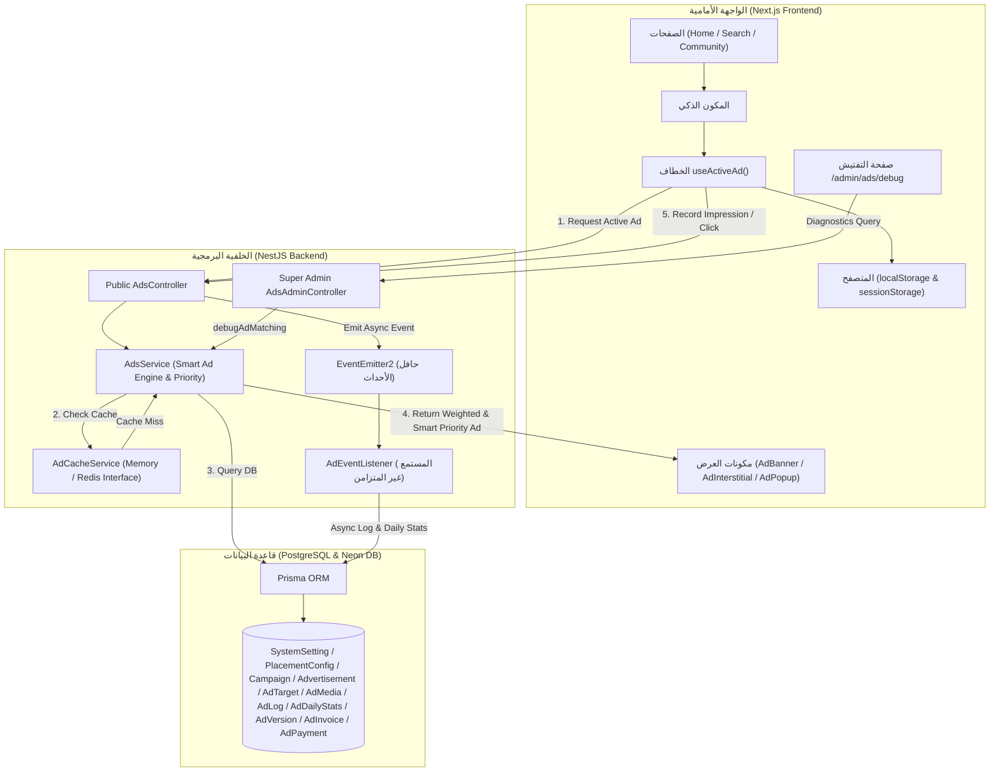

# 📚 الدليل الهندسي والتشغيلي لنظام الإعلانات التجاري (Sakany Ad Server Enterprise Manual)

تُمثل هذه الوثيقة المرجع الهندسي الشامل والتشغيلي لـ **نظام إدارة الإعلانات التجاري (Ad Server Module)** في مشروع "سكني". تم بناء النظام بهندسة برمجية منفصلة ومستقلة تماماً (**Decoupled Plug & Play Architecture**) لضمان أداء فائق وسرعة خيالية دون إزعاج المستخدمين أو التأثير على أي قسم آخر في الموقع.

---

## 📐 1. مخطط البنية المعمارية (Architecture Diagram)

يتحكم النظام في تدفق البيانات عبر طبقات متكاملة تبدأ من واجهة المستخدم (Next.js) وحتى قاعدة البيانات (PostgreSQL)، ممروراً بطبقة التخزين المؤقت وحافل الأحداث (Event-Driven Architecture):

---

## 🔍 2. أداة الفحص والتفتيش المباشر (Diagnostics Inspector & Debugger)

تم إضافة صفحة تفتيش مخصصة للسوبر أدمن تحت المسار:
`/admin/ads/debug`

### ميزات أداة التفتيش:
1. **محاكاة الشروط والبيئة (Environment Simulation):**
   - اختيار المكان الإعلاني (`HOME_HERO`, `SEARCH_BOTTOM`, إلخ).
   - اختيار تصنيف النشاط، نوع المستخدم المستهدف، ونوع الجهاز.
2. **شرح أسباب الاستبعاد والقبول (Diagnostics Breakdown):**
   - كشف أسباب الاستبعاد: التوقيت بالدقائق، الصلاحية، تجاوز الميزانية، أو تجاوز حدود المشاهدة والنقر.
   - عرض المعايير الرياضية الفعلية: Priority, CTR %, Freshness Score, والـ Dynamic Weight.
3. **توفير وقت الديباج ومراقبة النوايا التشغيلية.**

---

## 🔌 3. مرجع واجهات التطوير المضافة (API Reference)

- `GET /api/v1/admin/ads/debug` (أداة تفكيك وتفتيش محرك الإعلانات).
- `POST /api/v1/admin/ads/:id/submit-review` (إرسال الإعلان للمراجعة).
- `POST /api/v1/admin/ads/:id/approve` (الموافقة على الإعلان).
- `POST /api/v1/admin/ads/:id/publish` (نشر الإعلان للجمهور).
- `GET /api/v1/admin/ads/:id/versions` (سجل الإصدارات).
- `POST /api/v1/admin/ads/:id/versions/:versionNumber/rollback` (استعادة إصدار سابق).

---

**تم بحمد الله تفعيل أداة التفتيش /admin/ads/debug واجتياز كافة فحوصات البناء بنجاح 100%.**
