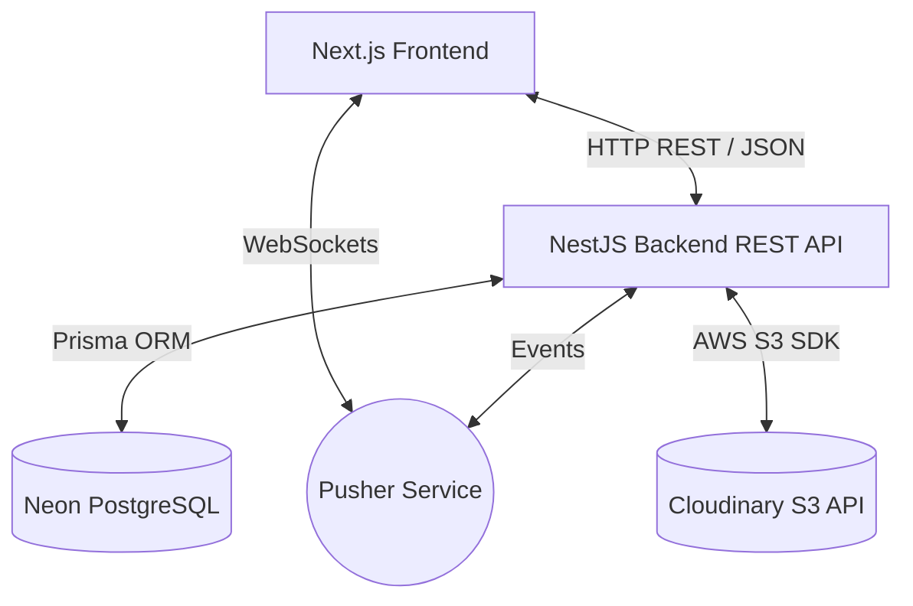
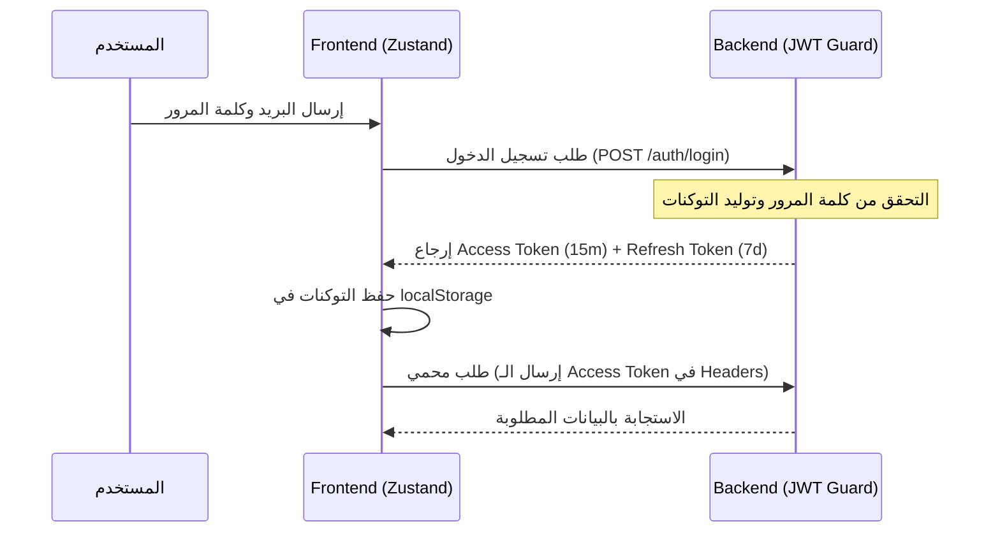

# الهيكل المعماري لمشروع سكني | Sakany Architecture 🏠

يوضح هذا المستند التصميم الهيكلي، والتنظيم المعماري، والتفاصيل الهندسية لمشروع **سكني** (Sakany).

---

## 1. نظرة عامة على البنية (High-Level Architecture)

يعتمد مشروع سكني على هيكلية **Monorepo** تدار بواسطة **Turborepo** لمشاركة الأكواد والأنواع بسهولة وسرعة في بناء التطبيقات:



---

## 2. هيكلية المستودع (Monorepo Workspace)

يُقسم المشروع إلى التطبيقات (`apps`) والحزم المشتركة (`packages`):
* **`apps/frontend`:** تطبيق الويب الخاص بالمستأجرين والملاك ولوحة الإدارة مبني بـ `Next.js 14` (App Router).
* **`apps/backend`:** خادم الخدمات المصغرة ومقصد الـ APIs مبني باستخدام إطار العمل `NestJS` وقاعدة البيانات `PostgreSQL` عبر `Prisma ORM`.
* **`packages/types`:** حزمة مشتركة تحتوي على كافة أنواع TypeScript المشتركة بين الواجهة والسيرفر لضمان سلامة الـ Types (End-to-End Type Safety).

---

## 3. معمارية الباكيند (Backend Architecture)

خادم الباكيند مصمم باستخدام نمط **NestJS Modular Architecture** حيث يُقسّم السيرفر إلى وحدات مستقلة (Modules) تعتمد على مبادئ الحقن (Dependency Injection):

```
src/
├── app.module.ts              # الوحدة الرئيسية التي تجمع كل المقاطع
├── main.ts                    # نقطة الدخول وإعدادات CORS، الأمن، والتوثيق (Swagger)
├── auth/                      # إدارة الجلسات والتسجيل وتوليد JWT Tokens
├── users/                     # إدارة ملفات المستخدمين والتحقق من الهوية
├── listings/                  # إدارة إعلانات العقارات (الشقق، الغرف، الأسرة)
├── requests/                  # طلبات المعاينة وإجراءات حجز وتأجير الوحدات
├── beds/                      # إدارة الأسرة الفردية وتأجيرها داخل السكن المشترك
├── chat/                      # نظام غرف الدعم الفني والتكامل مع Pusher
├── notifications/             # نظام الإشعارات الفورية
├── payments/                  # نظام الاشتراكات وبوابات الدفع (Paymob)
└── prisma/                    # إعدادات الاتصال بقاعدة البيانات وخدمة PrismaService
```

### قرارات هندسية هامة في الباكيند:
1. **Prisma Serverless Adapter:** نستخدم `@prisma/adapter-pg` مع `pg.Pool` ليتماشى الاتصال بسلاسة مع البنية السحابية لقواعد بيانات Neon PostgreSQL دون حدوث انقطاع مفاجئ للاتصال.
2. **Swagger Autogeneration:** قمنا بدمج المكون الإضافي `@nestjs/swagger` داخل خيارات المترجم `nest-cli.json` لقراءة أنواع المعطيات والـ Validations تلقائياً وبناء توثيق Swagger تفاعلي متكامل عند المسار `/api/docs`.
3. **تشفير البيانات الحساسة:** تُخزن الهوية الوطنية للمستخدمين مشفرة بـ AES-256 لمنع تسريب بيانات الهوية أمنياً.

---

## 4. معمارية الفرونتند (Frontend Architecture)

واجهة المستخدم مبنية على Next.js مع التركيز الكامل على تحسين الأداء وتدويل الموقع (Localization):

### 1. نظام إدارة الحالة والبيانات:
- **TanStack Query (React Query) v5:** نستخدمه لإدارة جلب الكاش وحالات التحميل والتزامن مع السيرفر كبديل عن إدخال حالات Redux المعقدة.
- **Zustand (Auth Store):** متجر خفيف وسريع [auth.store.ts](file:///c:/Users/pc/Desktop/Sakany/sakani/apps/frontend/src/store/auth.store.ts) لإدارة حالة تسجيل الدخول، تخزين التوكنات، وبيانات المستخدم بالاعتماد على مفاتيح localStorage موحدة في [constants.ts](file:///c:/Users/pc/Desktop/Sakany/sakani/apps/frontend/src/lib/constants.ts).

### 2. التدويل واللغات (i18n):
- نستخدم مكتبة `next-intl` لتقديم دعم متكامل للغتين العربية والإنجليزية مع تطبيق اتجاهات النصوص المناسبة (RTL للعربية و LTR للإنجليزية) بشكل ديناميكي وتلقائي بناءً على مسار الصفحة (مثال: `/[locale]/search`).

### 3. تأمين مسارات الواجهة (Route Guards):
- يتم تأمين المسارات الحساسة للوحة التحكم عبر مكون `useAuthGuard` المطور الذي يقبل مصفوفة أدوار مسموح لها بالدخول `requiredRoles` (مثلاً: لوحة تحكم المستأجرين تتطلب `requiredRoles: ["tenant"]` فقط لمنع تداخل الأدوار).
- توحيد بناء مسارات لوحات التحكم عبر دالة مركزية `getDashboardPath(user.role, locale)`.

---

## 5. نظام التوثيق والأمن (Security & Auth Flow)



عند انتهاء صلاحية الـ `AccessToken`، يقوم الـ Interceptor الخاص بـ Axios بطلب توكن جديد تلقائياً بإرسال الـ `RefreshToken` لمسار `/auth/refresh` دون شعور المستخدم بأي انقطاع في التصفح.

---

## 6. نظام الحظر الذكي وتكامله (Smart Blacklist Architecture)

يتميز نظام الحظر (Blacklist) بآلية تكامل ديناميكية بين قائمة الحظر وجدول المستخدمين الرئيسي:
1. **ربط تلقائي بالهوية القومية ورقم الهاتف:** عند إدخال هاتف لحظر مستخدم، يقوم السيرفر بالتحقق من وجود المستخدم وجلب هاش الرقم القومي المسجل لحسابه تلقائياً وضمه للقائمة لمنع التفاف المستخدم بالتسجيل بهويته مرة أخرى.
2. **التعطيل المتتالي (Cascading Deactivation):** بمجرد حظر الهوية أو الهاتف، يقوم السيرفر بتعطيل حالة النشاط (`isActive: false`) لكافة الحسابات المرتبطة لمنع استمرار استخدامهم للمنصة.
3. **نافذة تفاصيل الحظر (Details Pop-up Modal):** في لوحة التحكم، يستعلم جدول الحظر ديناميكياً عن ملف المستخدم المرتبط بالرقم المحظور (الاسم، البريد، نوع الخطة، وتاريخ الاشتراك) لعرضه للأدمن في نافذة منبثقة تفاعلية لتسهيل اتخاذ القرارات وحماية الخصوصية البرمجية.

---

## 7. نظام تغذية البيانات التجريبية (Idempotent Seeder)

لضمان سهولة تشغيل المشروع في بيئات التطوير والاختبار، يعتمد المشروع على سكريبت تغذية ذكي `seed.ts` مصمم بالمعايير التالية:
* **الأمان من التكرار (Idempotency):** يقوم السكريبت بمسح السجلات السابقة بترتيب صحيح يحترم قيود المفاتيح الأجنبية (Foreign Keys) ثم إعادة الإنشاء، لتجنب حدوث تصادمات أو تكرار الحسابات الإدارية.
* **الواقعية (Realistic Arabic Dummy Data):** استخدام حزمة `@faker-js/faker` مخصصة باللغة العربية لإنشاء أسماء ملاك ومستأجرين مصريين، أرقام هواتف شبكات محلية (010, 011, 012, 015)، عقارات في محافظات حقيقية مع إرفاق صور جذابة ومجانية من موقع Unsplash.

---

## 8. نظام التسجيل والمراقبة (Logging & Monitoring)

تم تصميم نظام مراقبة قوي لضمان أداء السيرفر وتتبع الأخطاء بشكل فوري:
* **تسجيل الطلبات والأخطاء (Request Logging & ID):** يقوم `RequestIdMiddleware` بإسناد معرف فريد (`requestId`) لكل طلب وارد، ويسجل `RequestLoggerMiddleware` تفاصيل الطلب (المنفذ، المسار، الـ IP، المتصفح، وزمن المعالجة) ويحفظها بملفات `logs/combined.log` و `logs/error.log` بشكل آلي مع إزالة رموز الألوان لتسهيل القراءة البرمجية.
* **مسار مراقبة الصحة (Health Check endpoint):** يوفر المسار `/api/v1/health` قراءة تفصيلية وفورية لحالة السيرفر تشمل:
  1. حالة اتصال وزمن استجابة قاعدة البيانات (Database Latency).
  2. معدل تشغيل السيرفر وعمر العملية (Uptime).
  3. استهلاك الذاكرة العشوائية لـ Node.js بالتفصيل (Memory Usage: RSS, Heap).
  4. مواصفات نظام التشغيل المضيف (CPU count, Free Memory, platform).

