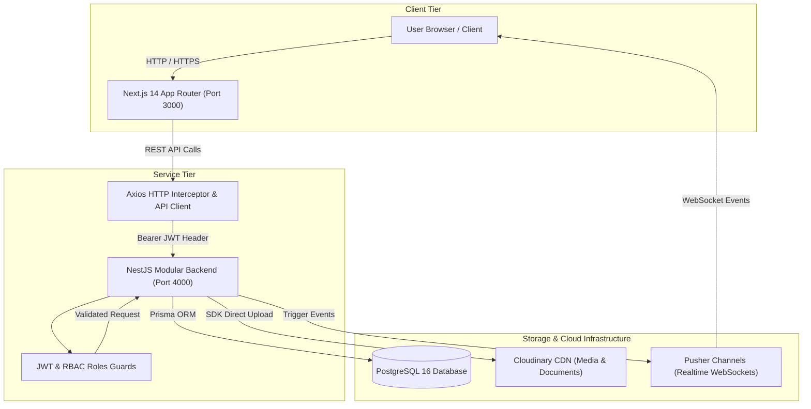
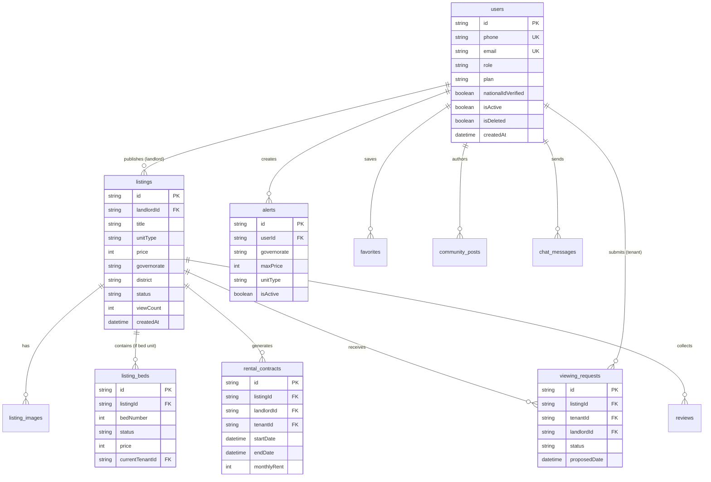
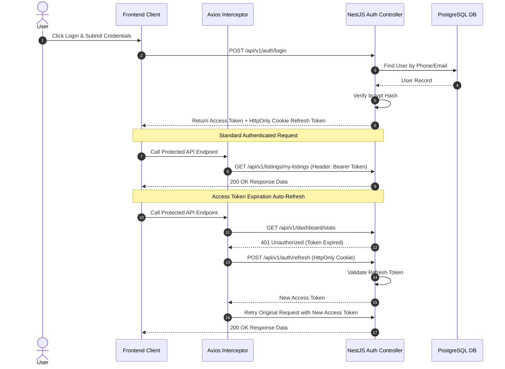
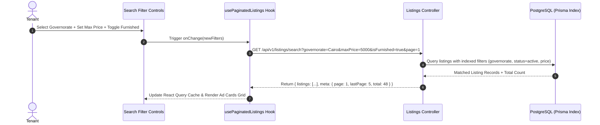
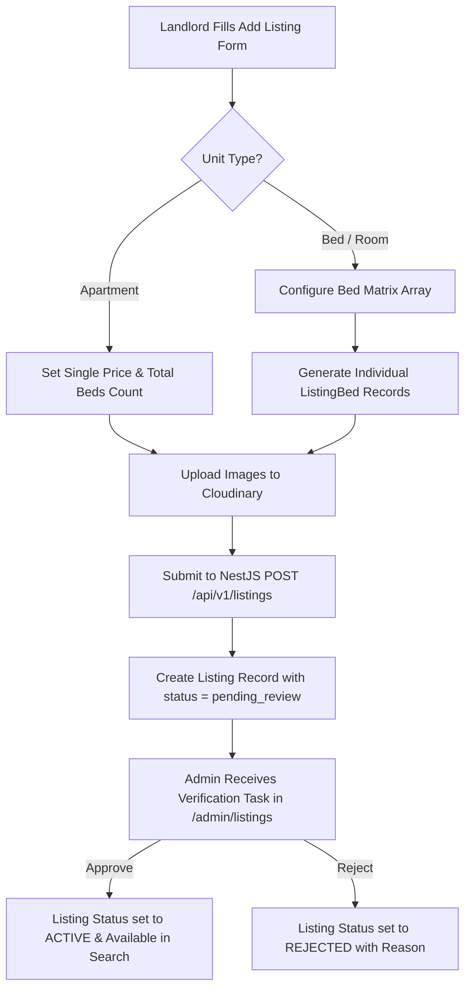
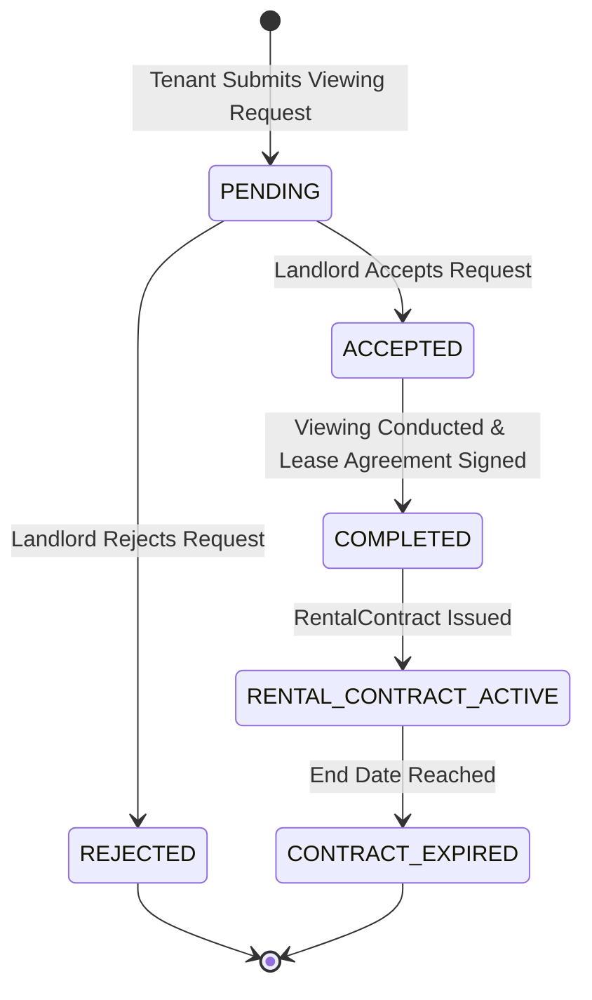
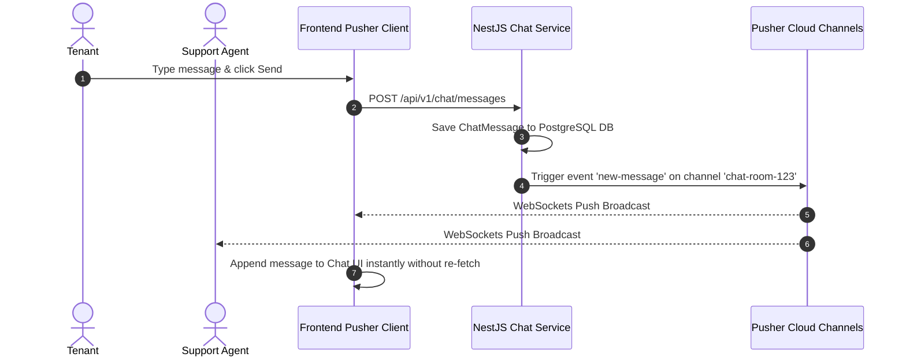
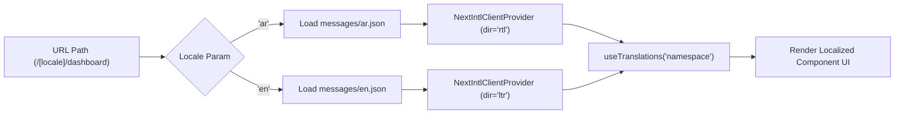

# 🏗️ Sakany (سكني) - System Architecture & Technical Diagrams

This document outlines the architectural blueprints, component relationships, data flow diagrams, and database entity models powering the **Sakany Platform**.

---

## Table of Contents
1. [High-Level System Architecture](#1-high-level-system-architecture)
2. [Monorepo & Workspace Layering](#2-monorepo--workspace-layering)
3. [Database Entity Relationship Diagram (ERD)](#3-database-entity-relationship-diagram-erd)
4. [Authentication & JWT Refresh Token Sequence](#4-authentication--jwt-refresh-token-sequence)
5. [Property Search & Filter Request Flow](#5-property-search--filter-request-flow)
6. [Listing Creation & Bed Allocation Pipeline](#6-listing-creation--bed-allocation-pipeline)
7. [Viewing Request & Contract Lifecycle State Machine](#7-viewing-request--contract-lifecycle-state-machine)
8. [Realtime WebSocket Chat Architecture](#8-realtime-websocket-chat-architecture)
9. [i18n Locale & Translation Resolution Pipeline](#9-i18n-locale--translation-resolution-pipeline)

---

## 1. High-Level System Architecture

```mermaid
graph TB
    subgraph Client Tier
        Browser["User Browser / Client"]
        FE_App["Next.js 14 App Router (Port 3000)"]
    end

    subgraph Service Tier
        API_GW["Axios HTTP Interceptor & API Client"]
        BE_App["NestJS Modular Backend (Port 4000)"]
        Guard["JWT & RBAC Roles Guards"]
    end

    subgraph Storage & Cloud Infrastructure
        DB[("PostgreSQL 16 Database")]
        Cloudinary["Cloudinary CDN (Media & Documents)"]
        Pusher["Pusher Channels (Realtime WebSockets)"]
    end

    Browser -->|HTTP / HTTPS| FE_App
    FE_App -->|REST API Calls| API_GW
    API_GW -->|Bearer JWT Header| BE_App
    BE_App --> Guard
    Guard -->|Validated Request| BE_App
    BE_App -->|Prisma ORM| DB
    BE_App -->|SDK Direct Upload| Cloudinary
    BE_App -->|Trigger Events| Pusher
    Pusher -->|WebSocket Events| Browser
```

---

## 2. Monorepo & Workspace Layering

```mermaid
graph TD
    Root["sakani/ (Turborepo Root)"]
    
    subgraph Frontend Workspace (apps/frontend)
        AppRouter["App Router (/[locale])"]
        I18n["next-intl Dictionaries (messages/ar.json & en.json)"]
        Features["Feature Modules (Search, Auth, Listings, Chat)"]
        ReactQuery["TanStack React Query Cache Layer"]
    end

    subgraph Backend Workspace (apps/backend)
        Controllers["NestJS Controllers (REST API Endpoints)"]
        Services["NestJS Services (Business Rules & Domain Logic)"]
        PrismaORM["Prisma Client & Migrations"]
    end

    Root --> Frontend Workspace
    Root --> Backend Workspace
    AppRouter --> Features
    Features --> ReactQuery
    ReactQuery -->|HTTP / REST| Controllers
    Controllers --> Services
    Services --> PrismaORM
```

---

## 3. Database Entity Relationship Diagram (ERD)

```mermaid
erDiagram
    users ||--o{ listings : "publishes (landlord)"
    users ||--o{ viewing_requests : "submits (tenant)"
    users ||--o{ alerts : "creates"
    users ||--o{ favorites : "saves"
    users ||--o{ community_posts : "authors"
    users ||--o{ chat_messages : "sends"
    
    listings ||--o{ listing_images : "has"
    listings ||--o{ listing_beds : "contains (if bed unit)"
    listings ||--o{ viewing_requests : "receives"
    listings ||--o{ rental_contracts : "generates"
    listings ||--o{ reviews : "collects"

    users {
        string id PK
        string phone UK
        string email UK
        string role
        string plan
        boolean nationalIdVerified
        boolean isActive
        boolean isDeleted
        datetime createdAt
    }

    listings {
        string id PK
        string landlordId FK
        string title
        string unitType
        int price
        string governorate
        string district
        string status
        int viewCount
        datetime createdAt
    }

    listing_beds {
        string id PK
        string listingId FK
        int bedNumber
        string status
        int price
        string currentTenantId FK
    }

    viewing_requests {
        string id PK
        string listingId FK
        string tenantId FK
        string landlordId FK
        string status
        datetime proposedDate
    }

    rental_contracts {
        string id PK
        string listingId FK
        string landlordId FK
        string tenantId FK
        datetime startDate
        datetime endDate
        int monthlyRent
    }

    alerts {
        string id PK
        string userId FK
        string governorate
        int maxPrice
        string unitType
        boolean isActive
    }
```

---

## 4. Authentication & JWT Refresh Token Sequence

```mermaid
sequenceDiagram
    autonumber
    actor User
    participant FE as Frontend Client
    participant Axios as Axios Interceptor
    participant BE as NestJS Auth Controller
    participant DB as PostgreSQL DB

    User->>FE: Click Login & Submit Credentials
    FE->>BE: POST /api/v1/auth/login
    BE->>DB: Find User by Phone/Email
    DB-->>BE: User Record
    BE->>BE: Verify bcrypt Hash
    BE-->>FE: Return Access Token + HttpOnly Cookie Refresh Token
    
    Note over FE,BE: Standard Authenticated Request
    FE->>Axios: Call Protected API Endpoint
    Axios->>BE: GET /api/v1/listings/my-listings (Header: Bearer Token)
    BE-->>FE: 200 OK Response Data

    Note over FE,BE: Access Token Expiration Auto-Refresh
    FE->>Axios: Call Protected API Endpoint
    Axios->>BE: GET /api/v1/dashboard/stats
    BE-->>Axios: 401 Unauthorized (Token Expired)
    Axios->>BE: POST /api/v1/auth/refresh (HttpOnly Cookie)
    BE->>BE: Validate Refresh Token
    BE-->>Axios: New Access Token
    Axios->>BE: Retry Original Request with New Access Token
    BE-->>FE: 200 OK Response Data
```

---

## 5. Property Search & Filter Request Flow

```mermaid
sequenceDiagram
    autonumber
    actor Tenant
    participant UI as Search Filter Controls
    participant Hook as usePaginatedListings Hook
    participant BE as Listings Controller
    participant DB as PostgreSQL (Prisma Index)

    Tenant->>UI: Select Governorate + Set Max Price + Toggle Furnished
    UI->>Hook: Trigger onChange(newFilters)
    Hook->>BE: GET /api/v1/listings/search?governorate=Cairo&maxPrice=5000&isFurnished=true&page=1
    BE->>DB: Query listings with indexed filters (governorate, status=active, price)
    DB-->>BE: Matched Listing Records + Total Count
    BE-->>Hook: Return { listings: [...], meta: { page: 1, lastPage: 5, total: 48 } }
    Hook-->>UI: Update React Query Cache & Render Ad Cards Grid
```

---

## 6. Listing Creation & Bed Allocation Pipeline

```mermaid
graph TD
    A[Landlord Fills Add Listing Form] --> B{Unit Type?}
    B -->|Apartment| C[Set Single Price & Total Beds Count]
    B -->|Bed / Room| D[Configure Bed Matrix Array]
    D --> E[Generate Individual ListingBed Records]
    C --> F[Upload Images to Cloudinary]
    E --> F
    F --> G[Submit to NestJS POST /api/v1/listings]
    G --> H[Create Listing Record with status = pending_review]
    H --> I[Admin Receives Verification Task in /admin/listings]
    I -->|Approve| J[Listing Status set to ACTIVE & Available in Search]
    I -->|Reject| K[Listing Status set to REJECTED with Reason]
```

---

## 7. Viewing Request & Contract Lifecycle State Machine

```mermaid
stateDiagram-v2
    [*] --> PENDING: Tenant Submits Viewing Request
    PENDING --> REJECTED: Landlord Rejects Request
    PENDING --> ACCEPTED: Landlord Accepts Request
    ACCEPTED --> COMPLETED: Viewing Conducted & Lease Agreement Signed
    COMPLETED --> RENTAL_CONTRACT_ACTIVE: RentalContract Issued
    RENTAL_CONTRACT_ACTIVE --> CONTRACT_EXPIRED: End Date Reached
    REJECTED --> [*]
    CONTRACT_EXPIRED --> [*]
```

---

## 8. Realtime WebSocket Chat Architecture

```mermaid
sequenceDiagram
    autonumber
    actor Tenant
    actor SupportAgent as Support Agent
    participant FE as Frontend Pusher Client
    participant BE as NestJS Chat Service
    participant Pusher as Pusher Cloud Channels

    Tenant->>FE: Type message & click Send
    FE->>BE: POST /api/v1/chat/messages
    BE->>BE: Save ChatMessage to PostgreSQL DB
    BE->>Pusher: Trigger event 'new-message' on channel 'chat-room-123'
    Pusher-->>FE: WebSockets Push Broadcast
    Pusher-->>SupportAgent: WebSockets Push Broadcast
    FE->>FE: Append message to Chat UI instantly without re-fetch
```

---

## 9. i18n Locale & Translation Resolution Pipeline

```mermaid
graph LR
    URL["URL Path (/[locale]/dashboard)"] --> LocaleCheck{"Locale Param"}
    LocaleCheck -->|'ar'| AR_Dict["Load messages/ar.json"]
    LocaleCheck -->|'en'| EN_Dict["Load messages/en.json"]
    AR_Dict --> Provider["NextIntlClientProvider (dir='rtl')"]
    EN_Dict --> Provider2["NextIntlClientProvider (dir='ltr')"]
    Provider --> Hook["useTranslations('namespace')"]
    Provider2 --> Hook
    Hook --> Component["Render Localized Component UI"]
```
