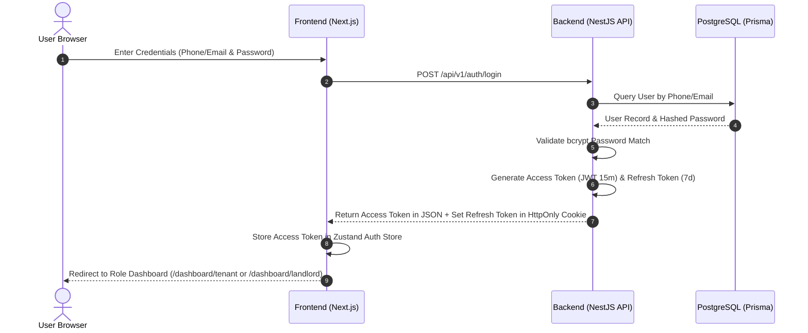
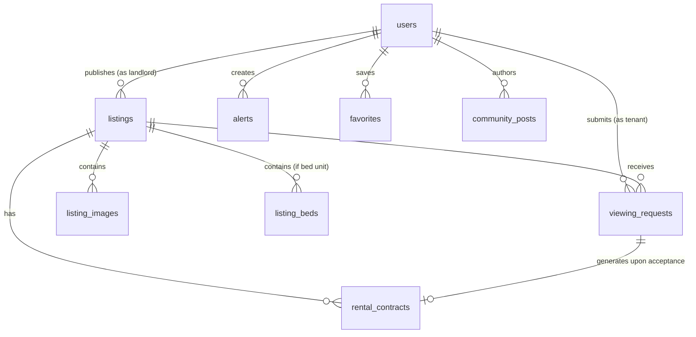

# 📘 Sakany (سكني) - Complete Technical Documentation & Master Reference Manual

Welcome to the official master documentation for **Sakany (سكني)**, Egypt's specialized property rental, bed-sharing, and student community platform. This document serves as the comprehensive technical guide for developers, system architects, and maintainers.

---

## Table of Contents
1. [Project Overview](#1-project-overview)
2. [Tech Stack](#2-tech-stack)
3. [Folder Structure](#3-folder-structure)
4. [Routing Architecture](#4-routing-architecture)
5. [User Roles & Permissions](#5-user-roles--permissions)
6. [Authentication & Authorization Flow](#6-authentication--authorization-flow)
7. [Database Schema & Entity Models](#7-database-schema--entity-models)
8. [Feature Breakdown](#8-feature-breakdown)
9. [API Architecture & Communication Layer](#9-api-architecture--communication-layer)
10. [State Management Strategy](#10-state-management-strategy)
11. [Internationalization (i18n) Framework](#11-internationalization-i18n-framework)
12. [Media & Document Upload System](#12-media--document-upload-system)
13. [Notification & Event Dispatch System](#13-notification--event-dispatch-system)
14. [Realtime Chat & Support System](#14-realtime-chat--support-system)
15. [Search, Filtering & Pagination Engine](#15-search-filtering--pagination-engine)
16. [Admin Control Panel Guide](#16-admin-control-panel-guide)
17. [Coding Standards & Architectural Constraints](#17-coding-standards--architectural-constraints)
18. [Known Issues & Technical Debt](#18-known-issues--technical-debt)
19. [Future Product Roadmap](#19-future-product-roadmap)
20. [Quick Start & Onboarding Guide for New Developers](#20-quick-start--onboarding-guide-for-new-developers)

---

## 1. Project Overview

### 1.1 What is Sakany?
**Sakany (سكني)** is an Egyptian web ecosystem tailored for housing search, room sharing, bed rentals, and student/youth community networking. It addresses structural challenges in the Egyptian housing market—specifically for university students and young workers relocating to major governorates (such as Cairo, Giza, Mansoura, Alexandria)—where finding verified, affordable, and safe rooming is historically fragmented.

### 1.2 Target Audience & User Profiles
- **Tenants (Students & Young Professionals):** Users searching for whole apartments, private rooms, or single beds with clear pricing, verified landlord badges, and roommate matching preferences.
- **Landlords & Property Owners:** Property managers and individuals listing apartments or beds, receiving structured viewing requests, managing bed occupancies, and tracking rental contracts.
- **Platform Administrators:** Support staff and super admins monitoring listing verifications, national ID verifications, user moderation, bans, reports, and platform health.

### 1.3 Key Value Propositions
- **Bed-Level Housing Granularity:** Rent individual beds within shared rooms rather than forcing entire apartment leases.
- **National ID & Verification Badges:** Increased safety through encrypted identity verification.
- **Localized i18n:** Bilingual Arabic (`ar`) and English (`en`) interface with native RTL/LTR layout handling.
- **Live Support & Community Hub:** Real-time support chat and roommate discovery boards.

---

## 2. Tech Stack

### 2.1 Frontend Stack
- **Framework:** Next.js 14.2 (App Router with Server & Client Component separation)
- **Language:** TypeScript 5.x (Strict mode enabled)
- **Styling & UI Tokens:** Vanilla CSS design tokens + Tailwind CSS 3.4
- **Icons:** Lucide React (`lucide-react`)
- **i18n Engine:** `next-intl` 4.x (Dictionary JSON based, path-based locale routing `/[locale]`)
- **Client State & Server Cache:** TanStack React Query v5 (`@tanstack/react-query`)
- **Forms & Validation:** React Hook Form (`react-hook-form`), Zod schema validation (`zod`)
- **Realtime Client:** Pusher JS (`pusher-js`)
- **Maps:** Leaflet & React Leaflet (`leaflet`, `react-leaflet`)

### 2.2 Backend Stack
- **Framework:** NestJS 10.0 (Modular monolith architecture with Dependency Injection)
- **Language:** TypeScript 5.x / Node.js 20.x
- **Database ORM:** Prisma ORM 5.x with `@prisma/client`
- **Database Engine:** PostgreSQL 16 (Relational DB with index optimization)
- **Authentication:** JWT (JSON Web Tokens) with HttpOnly Refresh Tokens & Passport Passport-JWT
- **Encryption:** `bcryptjs` for password hashing, Node `crypto` AES-256-GCM for National ID encryption

### 2.3 External Integrations & Cloud Services
- **Cloud Storage:** Cloudinary REST SDK (Image uploads, avatar cropping, ID document handling)
- **Realtime WebSockets:** Pusher Cloud Channels
- **Email Delivery:** Resend API / SMTP Service

---

## 3. Folder Structure

The project is structured as a **Turborepo Monorepo**:

```text
sakani/
├── apps/
│   ├── frontend/                            # Next.js Application Root
│   │   ├── messages/                        # i18n Translation Files
│   │   │   ├── ar.json                      # Arabic UI Dictionaries
│   │   │   └── en.json                      # English UI Dictionaries
│   │   ├── public/                          # Static Assets (Images, Icons, Fonts)
│   │   └── src/
│   │       ├── app/                         # Next.js App Router Pages
│   │       │   └── [locale]/                # Dynamic Locale Prefix Route
│   │       │       ├── (auth)/              # Login, Register, OTP Routes
│   │       │       ├── admin/               # Admin Control Panel Routes
│   │       │       ├── community/           # Community Hub Pages
│   │       │       ├── dashboard/           # User Dashboards (Landlord, Tenant, Support)
│   │       │       ├── listing/[id]/        # Listing Detail Page
│   │       │       ├── search/              # Search & Discovery Page
│   │       │       ├── layout.tsx           # Locale Root Layout & Providers
│   │       │       └── page.tsx             # Landing / Home Page
│   │       ├── components/                  # Global Reusable Components
│   │       │   ├── layout/                  # Main Navbar, Footer, Sidebar, Layouts
│   │       │   └── ui/                      # Modal, Button, Card, Badge, Input, Toast
│   │       ├── features/                    # Feature-Driven Business Modules
│   │       │   ├── auth/                    # Auth Store, Forms, Guard Wrappers
│   │       │   ├── dashboard/               # Stats Strips, Urgent Banners, Recommendations
│   │       │   ├── search/                  # Search Controls, Chips, Maps, Pagination
│   │       │   └── listings/                # Ad Cards, Photo Galleries, Roommate Selectors
│   │       ├── hooks/                       # Custom React Query & UI Hooks
│   │       │   ├── useListings.ts           # Listing CRUD & Search React Query Hooks
│   │       │   ├── useAdmin.ts              # Admin API React Query Hooks
│   │       │   ├── useAuth.ts               # Auth State & Session Hooks
│   │       │   └── useAlerts.ts             # Smart Housing Alert Hooks
│   │       ├── lib/                         # Utilities & Helpers
│   │       │   ├── constants.ts             # Governorates, Unit Types, Amenities
│   │       │   ├── formatters.ts            # Currency, Date & Number Formatters
│   │       │   └── utils.ts                 # Classname mergers (clsx, twMerge)
│   │       └── types/                       # Shared Frontend TypeScript Declarations
│   │
│   └── backend/                             # NestJS Application Root
│       ├── prisma/                          # Prisma Schema & Database Assets
│       │   ├── migrations/                  # SQL Schema Migration History
│       │   ├── schema.prisma                # Master Prisma Entity Models & Enums
│       │   └── seed.ts                      # Database Seeder Script
│       └── src/
│           ├── auth/                        # Auth Controllers, JWT Strategies, Guards
│           ├── listings/                    # Listing Services, Controllers & DTOs
│           ├── requests/                    # Viewing Requests & Contract Controllers
│           ├── users/                       # User Profiles & Account Deletion Lifecycle
│           ├── community/                   # Community Posts, Replies & Alert Matching
│           ├── chat/                        # Support & P2P Realtime Chat Modules
│           ├── notifications/               # Event Dispatchers & Push Notification Handlers
│           └── uploads/                     # Cloudinary Direct Upload Controllers
```

---

## 4. Routing Architecture

### 4.1 Frontend App Router (`apps/frontend/src/app/[locale]`)

| Route | Access Level | Description |
| :--- | :--- | :--- |
| `/[locale]/` | Public | Home landing page with hero search, featured listings, and statistics |
| `/[locale]/search` | Public | Interactive search engine with filters, sorting, and map view |
| `/[locale]/listing/[id]` | Public | Comprehensive listing view with bed matrix, landlord badge, & request form |
| `/[locale]/login` | Public (Unauth) | User authentication form with phone/email and password |
| `/[locale]/register` | Public (Unauth) | Multi-step registration (Tenant / Landlord role selection) |
| `/[locale]/dashboard/tenant` | Tenant | Tenant Overview dashboard (requests, active rentals, saved searches) |
| `/[locale]/dashboard/tenant/viewing-requests` | Tenant | Track submitted viewing request statuses and scheduled dates |
| `/[locale]/dashboard/tenant/wishlist` | Tenant | Saved favorite listings and archived cards |
| `/[locale]/dashboard/tenant/alerts` | Tenant | Smart housing notifications management |
| `/[locale]/dashboard/landlord` | Landlord | Landlord Overview dashboard (earnings, beds, urgent action items) |
| `/[locale]/dashboard/landlord/advertisements` | Landlord | Manage published, draft, and paused property listings |
| `/[locale]/dashboard/landlord/beds` | Landlord | Bed-level vacancy grid management |
| `/[locale]/dashboard/landlord/requests` | Landlord | Incoming viewing requests approval/rejection panel |
| `/[locale]/dashboard/support` | Tenant / Landlord | Live chat support room with platform agent |
| `/[locale]/community` | Public / Verified | Community discussion board, roommate searches, and category posts |
| `/[locale]/admin` | Admin / Super | Overview admin metrics, pending verifications, system health |
| `/[locale]/admin/users` | Admin / Super | User management, role elevation, identity verification approval |
| `/[locale]/admin/listings` | Admin / Super | Listing moderation panel (approve/reject property submissions) |
| `/[locale]/admin/banned` | Admin / Super | Banned user phone index and ban removal management |
| `/[locale]/admin/account-lifecycle` | Admin / Super | Self-deactivation grace period tracker & account purge triggers |

---

## 5. User Roles & Permissions

Sakany enforces strict Role-Based Access Control (RBAC) across both API endpoints and frontend views:

```mermaid
graph TD
    User Role Matrix
    R1[tenant] -->|Can| T1["Search Listings, Submit Requests, Wishlist, Smart Alerts, Community Posts"]
    R2[landlord] -->|Can| L1["Create/Edit Listings, Manage Beds, Approve Requests, Issue Contracts"]
    R3[admin] -->|Can| A1["Moderate Listings, Verify Users, Review Reports, Access Admin Dashboards"]
    R4[super_admin] -->|Can| S1["Manage Admin Roles, Permanent Purge Accounts, Modify System Settings"]
```

### 5.1 RBAC Enforcement Mechanisms
- **Backend:** NestJS `@Roles(UserRole.admin, UserRole.super_admin)` custom decorator combined with `RolesGuard` and `JwtAuthGuard`.
- **Frontend:** `useAuthGuard({ requiredRoles: ['landlord'] })` wrapper hook that automatically redirects unauthorized users to `/[locale]/login`.

---

## 6. Authentication & Authorization Flow



### 6.1 Token Lifetime & Security
- **Access Token:** Short-lived JWT (15-60 minutes) containing `sub` (userId), `role`, and `plan`. Sent in HTTP `Authorization: Bearer <token>` header.
- **Refresh Token:** Long-lived HTTP-Only, SameSite cookie used automatically by axios interceptor (`api.ts`) to request a fresh Access Token upon expiration (`POST /api/v1/auth/refresh`).

---

## 7. Database Schema & Entity Models

The database is built on **PostgreSQL 16** managed via **Prisma ORM**. Key models include:

### 7.1 Core Entities Summary



#### 1. `users` (User Account Record)
- Stores user credentials, contact details, identity verification status (`NONE`, `PENDING`, `VERIFIED`, `REJECTED`), role (`tenant`, `landlord`, `admin`, `super_admin`), encrypted national ID (`nationalIdEnc`), and account deletion grace-period timestamps.

#### 2. `listings` (Property Advertisement)
- Stores title, unit type (`apartment`, `room`, `bed`), pricing, deposit, governorate, district, geocoordinates (`lat`, `lng`), amenities array, status (`draft`, `pending_review`, `active`, `rented`, `paused`, `rejected`), and view counter.

#### 3. `listing_beds` (Individual Bed Matrix)
- Tracks bed number, status (`available`, `rented`), bed type (`single`, `double`), monthly rent price, and current assigned tenant ID.

#### 4. `viewing_requests` (Rental & Viewing Application)
- Connects tenant, landlord, and listing. Stores proposed date, message, status (`pending`, `accepted`, `rejected`, `completed`), and move-in target date.

#### 5. `community_posts` (Student & Roommate Board)
- Stores category ID, author ID, title, content, governorate, target gender, and reply counter.

---

## 8. Feature Breakdown

### 8.1 Property & Bed Listing Engine
- Landlords can publish full apartments or individual beds within shared rooms.
- Automatic occupancy status calculations: when all beds in a listing are set to `rented`, the listing status automatically transitions to `rented`.

### 8.2 Smart Roommate & Housing Alerts
- Tenants can create automated search alerts specifying governorate, maximum budget, unit type, and gender preference (`male`, `female`, `family`).
- When a new listing matching criteria is approved by admins, the system dispatches an alert notification to matched tenants.

### 8.3 Student Community Hub
- Categorized discussion board (Roommate Search, University Housing Tips, Furniture Sale, General Discussion).
- Upvoting, replies, and community moderation report triggers.

---

## 9. API Architecture & Communication Layer

Frontend-to-Backend HTTP requests are routed through a unified Axios client (`@/services/api.ts`):

```text
Frontend Component / Hook
       │ (React Query Hook)
       ▼
Axios API Instance (baseURL: http://localhost:4000/api/v1)
       │ (Adds Bearer Token & Handles 401 Refresh Interceptors)
       ▼
NestJS API Route Controller (@Controller('listings'))
       │ (Validates Input via Zod/ValidationPipe DTOs)
       ▼
NestJS Service Layer (@Injectable() ListingsService)
       │ (Executes DB Queries & Business Rules)
       ▼
Prisma ORM (@prisma/client) ──► PostgreSQL 16 DB
```

---

## 10. State Management Strategy

1. **Server State & Caching:** Managed strictly via **TanStack React Query v5**. Mutation invalidation keys (e.g. `queryClient.invalidateQueries({ queryKey: ["my-listings"] })`) ensure immediate UI sync upon edits.
2. **Global Client Session:** Managed via **Zustand** (`useAuthStore`) to persist user profile details, roles, and access tokens across client page transitions.
3. **Local Component State:** Standard React `useState` / `useReducer` for ephemeral UI controls (modals, search input debounces, tab switches).

---

## 11. Internationalization (i18n) Framework

The platform supports bilingual Arabic (`ar`) and English (`en`) using `next-intl`:

### 11.1 File Architecture
- `apps/frontend/messages/ar.json` — Arabic UI strings.
- `apps/frontend/messages/en.json` — English UI strings.

### 11.2 Key Guidelines for i18n
- **Zero Hardcoded Strings:** All user-facing UI labels must use `useTranslations("namespace")`.
- **Reuse Common Keys:** Standard status badges, unit types, and button actions consume `common.status.*` and `common.actions.*` keys to eliminate dictionary bloat.
- **Data Protection:** Dynamic user-generated text (listing titles, descriptions, landlord notes) and database records are never modified or forced through translation hooks.

---

## 12. Media & Document Upload System

Image management is powered by **Cloudinary Direct REST API**:
- Supported media: Property photos, user profile avatars, national ID verification scans.
- Max file sizes: 5MB for profile photos, 10MB for high-resolution property photos.
- Frontend image optimization: `getImageUrl()` utility handles fallback placeholders and Cloudinary CDN URL transformations.

---

## 13. Notification & Event Dispatch System

System events trigger in-app notifications and push updates:
- Event keys: `LISTING_APPROVED`, `REQUEST_CREATED`, `REQUEST_ACCEPTED`, `CONTRACT_EXPIRED`, `COMMUNITY_ALERT_MATCH`.
- Notifications store priority levels (`LOW`, `NORMAL`, `HIGH`, `URGENT`) and are presented to users via the top-bar notification bell and dashboard urgent banners.

---

## 14. Realtime Chat & Support System

- **Live Support Chat (`/dashboard/support`):** Allows tenants and landlords to chat directly with platform support agents.
- **Realtime Transport:** Powered by **Pusher WebSockets**. Frontend subscribes to private channels (e.g. `private-chat-{conversationId}`) for instant message rendering and online typing indicators.

---

## 15. Search, Filtering & Pagination Engine

The `/search` discovery page executes high-performance parameterized queries against the Prisma PostgreSQL index:
- **Filters:** Governorate select, District text search, Unit Type toggle, Price range slider (Min/Max EGP), Furnished toggle, Verified Landlord check, Gender Target (`male`, `female`, `mixed`, `family`).
- **Sorting Options:** `newest` (Newest first), `cheapest` (Lowest price), `expensive` (Highest price), `popular` (Most views).
- **Pagination:** Server-side pagination returning 10 items per page with metadata (`total`, `page`, `limit`, `lastPage`).

---

## 16. Admin Control Panel Guide

Accessible strictly to users with `admin` or `super_admin` roles:
- **Listings Moderation (`/admin/listings`):** Review property submissions, inspect property photos and exact locations, and issue approval or rejection with reason.
- **User Management (`/admin/users`):** Elevate user roles, verify national identity submissions, or suspend abusive accounts.
- **Banned User Index (`/admin/banned`):** Blacklist malicious phone numbers to prevent re-registration.
- **Account Lifecycle Panel (`/admin/account-lifecycle`):** Track self-deactivated accounts within 30-day grace periods and trigger hard deletion purges.

---

## 17. Coding Standards & Architectural Constraints

1. **Strict TypeScript:** No `any` types allowed in core services or components; define explicit interfaces in `@/types`.
2. **Preserve API Contracts:** Never change backend request/response property names without updating the corresponding frontend TypeScript interface.
3. **RTL/LTR Layout Hygiene:** Always use Tailwind logical property utilities (`ps-4`, `pe-4`, `start-0`, `end-0`) alongside `dir={isAr ? "rtl" : "ltr"}` to ensure flawless rendering across both Arabic and English.
4. **No Direct Production Mutations:** Database migrations must be generated via `prisma migrate dev` and committed to git.

---

## 18. Known Issues & Technical Debt

- **Geocoding API Fallback:** OpenStreetMap Nominatim geocoding rate-limiting requires fallback to default governorate coordinates on high search traffic.
- **Push Notification Service Workers:** Push notification subscriptions require browser permissions grant; email notification fallbacks execute when push is disabled.

---

## 19. Future Product Roadmap

- 📱 **Native Mobile Application:** React Native / Expo mobile app sharing backend NestJS REST APIs.
- 💳 **Online Payment Gateway:** Integration with Paymob / Fawry for digital security deposit holds and monthly rent collection.
- 🗺️ **Interactive Campus Maps:** Micro-distance calculations to major Egyptian public and private universities (Cairo University, GUC, AUC, Mansoura University).
- 🤖 **AI-Powered Matchmaking:** Automated roommate compatibility scoring based on lifestyle habits and study schedules.

---

## 20. Quick Start & Onboarding Guide for New Developers

Welcome aboard! Follow this step-by-step checklist to start contributing:

```text
1. Clone Repository & Install Dependencies
   $ git clone https://github.com/your-org/sakani.git
   $ cd sakani
   $ npm install

2. Configure Local Environment Variables
   $ cp apps/backend/.env.example apps/backend/.env
   $ cp apps/frontend/.env.example apps/frontend/.env.local

3. Initialize PostgreSQL Database & Run Migrations
   $ cd apps/backend
   $ npx prisma migrate dev --name init
   $ npx prisma db seed
   $ cd ../..

4. Start Development Environment
   $ npm run dev
```

### Where to Find Things:
- **To modify Property Listings UI:** `apps/frontend/src/features/listings`
- **To edit Landlord or Tenant Dashboards:** `apps/frontend/src/app/[locale]/dashboard`
- **To update Translation Strings:** `apps/frontend/messages/ar.json` & `apps/frontend/messages/en.json`
- **To edit Database Models:** `apps/backend/prisma/schema.prisma`
- **To add new API Endpoints:** `apps/backend/src/`
